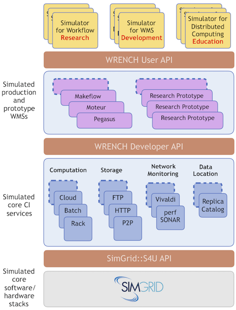

Overview                        {#mainpage}
============

@WRENCHUserDoc 
User Documentation
 @endWRENCHDoc
@WRENCHDeveloperDoc  
Developer Documentation
 @endWRENCHDoc
@WRENCHInternalDoc  
Internal Documentation
 @endWRENCHDoc

[TOC]

  

[WRENCH](http://wrench-project.org) enables novel avenues for scientific workflow use, 
research, development, and education in the context of large-scale scientific 
computations and data analyses.
WRENCH capitalizes on recent and critical advances in terms of distributed 
platform/application simulation. 
These advances make it possible to simulate the execution of large scale 
workflows in a way that is both accurate (validated simulation models), scalable 
(low ratio of simulation time to simulated time, ability to run large simulations 
on a single computer with low hardware and energy costs), and expressive (ability 
to describe arbitrary platforms and applications, ability to quickly develop 
simulations). More specifically, WRENCH is built on top of the open-source 
[SIMGRID](http://simgrid.gforge.inria.fr) simulation framework.

Through the use of SIMGRID, WRENCH provides the ability to: 

- Rapidly prototype implementations of WMS components and underlying algorithms; 
- Quickly simulate arbitrary workflow and platform scenarios for a simulated WMS 
  implementation; and 
- Run extensive experimental campaigns results to conclusively compare workflow 
  designs and WMS designs.

 

# Architecture #                        {#overview-architecture}
________

Technically speaking, WRENCH is an _open-source library_. It is neither a graphical 
interface nor a command-line simulator running user scripts. As in SimGrid, the 
interaction with WRENCH is done by writing programs with the exposed functions to 
build your own simulator.

WRENCH is composed by four modules designed as simulation components (**building 
blocks**):

- **Simulation Engine:** actual simulation component – provides the necessary models to simulate individual hardware resources (compute, network, and storage resources).
- **Computing:** models for the target execution infrastructure (e.g., clouds, batch processing, etc.).
- **Services:** collection of services that can be attached to computing or used by the workflow management system.
- **Workflow Management System:** top-level layer that provides a collection of managers and abstractions for composing a workflow management system.

 

# Classes of Users #                       {#overview-users}
________

WRENCH is designed for supporting three different classes of users:

- **Scientists:** make quick and informed choices when executing their workflows.
- **Software Developers:** implement more efficient software infrastructures to support workflows.
- **Researchers:** develop novel efficient algorithms to be embedded within these software infrastructures.

## Levels of Documentation ##              {#overview-users-levels}

The WRENCH library provides three _incremental_ levels of documentation.

**User:** targets _scientists_ who want to use WRENCH for running scientific workflows 
in different simulated scenarios. _Users_ are NOT expected to develop novel algorithms, 
services, or computing abstractions for WRENCH, instead they use the set of available 
simulation components to build a WMS simulator to run their workflows. 
@WRENCHNotUserDoc ([See User Documentation](../user/index.html)) @endWRENCHDoc

**Developer:** targets _software developers_ and _researchers_ aiming the development 
of novel algorithms, services, or computing environments. In addition to documentation 
for all simulation components provided in the _User_ level, here it is also provided
detailed documentation for all abstract classes for creating your own algorithms, 
services, or computing environments.
@WRENCHNotDeveloperDoc ([See Developer Documentation](../developer/index.html)) @endWRENCHDoc

**Internal:** targets users who want to contribute code for WRENCH. The _internal_ level
provides, in addition to all levels above, a detailed documentation for all WRENCH classes
including binders to SimGrid, and workflow-specific classes (e.g., job types, parsers, etc.).
@WRENCHNotInternalDoc ([See Internal Documentation](../internal/index.html)) @endWRENCHDoc

